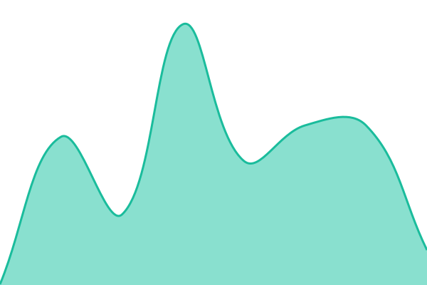
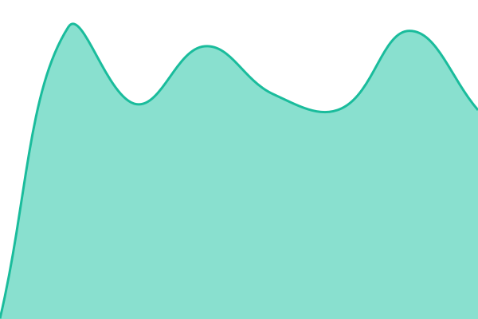

# [📈 Live Status](https://status.ludicdrive.com): <!--live status--> **🟩 All systems operational**

This repository contains the open-source uptime monitor and status page for [ludicdrive](https://status.ludicdrive.com), powered by [Upptime](https://github.com/upptime/upptime).

<!--start: status pages-->
<!-- This summary is generated by Upptime (https://github.com/upptime/upptime) -->
<!-- Do not edit this manually, your changes will be overwritten -->
<!-- prettier-ignore -->
| URL | Status | History | Response Time | Uptime |
| --- | ------ | ------- | ------------- | ------ |
|  [Landscaping](https://landscaping.ludicdrive.com) | 🟩 Up | [landscaping.yml](https://github.com/ludicdrive/uptime-monitor/commits/HEAD/history/landscaping.yml) | 

 768ms
     
 | 

<a href="https://status.ludicdrive.com/history/landscaping">100.00%</a>
    

|  [Maps - Landscaping](https://maps.ludicdrive.com) | 🟩 Up | [maps-landscaping.yml](https://github.com/ludicdrive/uptime-monitor/commits/HEAD/history/maps-landscaping.yml) | 

 466ms
     
 | 

<a href="https://status.ludicdrive.com/history/maps-landscaping">100.00%</a>
    

|  [Maps - Landscaping System](https://maps2.ludicdrive.com) | 🟩 Up | [maps-landscaping-system.yml](https://github.com/ludicdrive/uptime-monitor/commits/HEAD/history/maps-landscaping-system.yml) | 

 713ms
     
 | 

<a href="https://status.ludicdrive.com/history/maps-landscaping-system">100.00%</a>
    

|  [Ludic Drive](https://ludicdrive.com) | 🟩 Up | [ludic-drive.yml](https://github.com/ludicdrive/uptime-monitor/commits/HEAD/history/ludic-drive.yml) | 

 768ms
     
 | 

<a href="https://status.ludicdrive.com/history/ludic-drive">100.00%</a>
    

|  [Unreal/Assetstore](https://unrealassetstore.com) | 🟩 Up | [unreal-assetstore.yml](https://github.com/ludicdrive/uptime-monitor/commits/HEAD/history/unreal-assetstore.yml) | 

 1333ms
     
 | 

<a href="https://status.ludicdrive.com/history/unreal-assetstore">100.00%</a>
    

|  [Unreal/Assetstore Loader](https://api.amm.unrealassetstore.com/user/ready) | 🟩 Up | [unreal-assetstore-loader.yml](https://github.com/ludicdrive/uptime-monitor/commits/HEAD/history/unreal-assetstore-loader.yml) | 

 427ms
     
 | 

<a href="https://status.ludicdrive.com/history/unreal-assetstore-loader">100.00%</a>
    

|  [salzzeit.at](https://salzzeit.at) | 🟩 Up | [salzzeit-at.yml](https://github.com/ludicdrive/uptime-monitor/commits/HEAD/history/salzzeit-at.yml) | 

 590ms
     
 | 

<a href="https://status.ludicdrive.com/history/salzzeit-at">100.00%</a>
    

|  [salzzeit.com](https://salzzeit.com) | 🟩 Up | [salzzeit-com.yml](https://github.com/ludicdrive/uptime-monitor/commits/HEAD/history/salzzeit-com.yml) | 

 496ms
     
 | 

<a href="https://status.ludicdrive.com/history/salzzeit-com">100.00%</a>
    

|  [salzzeitmuseen.salzzeit.at](https://salzzeitmuseen.salzzeit.at/) | 🟩 Up | [salzzeitmuseen-salzzeit-at.yml](https://github.com/ludicdrive/uptime-monitor/commits/HEAD/history/salzzeitmuseen-salzzeit-at.yml) | 

 579ms
     
 | 

<a href="https://status.ludicdrive.com/history/salzzeitmuseen-salzzeit-at">100.00%</a>
    

|  [salzzeitmuseen.salzzeit.com](https://salzzeitmuseen.salzzeit.com/) | 🟩 Up | [salzzeitmuseen-salzzeit-com.yml](https://github.com/ludicdrive/uptime-monitor/commits/HEAD/history/salzzeitmuseen-salzzeit-com.yml) | 

 475ms
     
 | 

<a href="https://status.ludicdrive.com/history/salzzeitmuseen-salzzeit-com">100.00%</a>
    

<!--end: status pages-->

[**Visit our status website →**](https://status.ludicdrive.com)

## 📄 License

- Powered by: [Upptime](https://github.com/upptime/upptime)
- Code: [MIT](./LICENSE) © [Anand Chowdhary](https://anandchowdhary.com), supported by [Pabio](https://pabio.com)
- Data in the `./history` directory: [Open Database License](https://opendatacommons.org/licenses/odbl/1-0/)
