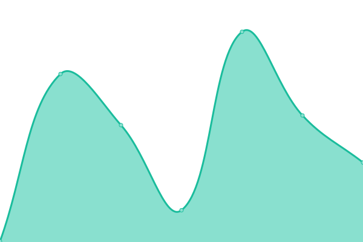

# [📈 Live Status](https://status.ludicdrive.com): <!--live status--> **🟩 All systems operational**

This repository contains the open-source uptime monitor and status page for [ludicdrive](https://status.ludicdrive.com), powered by [Upptime](https://github.com/upptime/upptime).

<!--start: status pages-->
<!-- This summary is generated by Upptime (https://github.com/upptime/upptime) -->
<!-- Do not edit this manually, your changes will be overwritten -->
<!-- prettier-ignore -->
| URL | Status | History | Response Time | Uptime |
| --- | ------ | ------- | ------------- | ------ |
|  [Landscaping](https://landscaping.ludicdrive.com) | 🟩 Up | [landscaping.yml](https://github.com/ludicdrive/uptime-monitor/commits/HEAD/history/landscaping.yml) | 

 889ms
     
 | 

<a href="https://status.ludicdrive.com/history/landscaping">100.00%</a>
    

|  [Maps](https://maps.ludicdrive.com) | 🟩 Up | [maps.yml](https://github.com/ludicdrive/uptime-monitor/commits/HEAD/history/maps.yml) | 

 211ms
     
 | 

<a href="https://status.ludicdrive.com/history/maps">100.00%</a>
    

|  [Ludic Drive](https://ludicdrive.com) | 🟩 Up | [ludic-drive.yml](https://github.com/ludicdrive/uptime-monitor/commits/HEAD/history/ludic-drive.yml) | 

 1421ms
     
 | 

<a href="https://status.ludicdrive.com/history/ludic-drive">100.00%</a>
    

|  [Unreal/Assetstore](https://unrealassetstore.com) | 🟩 Up | [unreal-assetstore.yml](https://github.com/ludicdrive/uptime-monitor/commits/HEAD/history/unreal-assetstore.yml) | 

 5422ms
     
 | 

<a href="https://status.ludicdrive.com/history/unreal-assetstore">100.00%</a>
    

|  [Unreal/Assetstore Loader](https://amm.assetstore-ue.com/user/ready) | 🟩 Up | [unreal-assetstore-loader.yml](https://github.com/ludicdrive/uptime-monitor/commits/HEAD/history/unreal-assetstore-loader.yml) | 

 1373ms
     
 | 

<a href="https://status.ludicdrive.com/history/unreal-assetstore-loader">99.60%</a>
    

|  [Storage](https://cloud.ludicdrive.com) | 🟩 Up | [storage.yml](https://github.com/ludicdrive/uptime-monitor/commits/HEAD/history/storage.yml) | 

 619ms
     
 | 

<a href="https://status.ludicdrive.com/history/storage">100.00%</a>
    

<!--end: status pages-->

[**Visit our status website →**](https://status.ludicdrive.com)

## 📄 License

- Powered by: [Upptime](https://github.com/upptime/upptime)
- Code: [MIT](./LICENSE) © [Anand Chowdhary](https://anandchowdhary.com), supported by [Pabio](https://pabio.com)
- Data in the `./history` directory: [Open Database License](https://opendatacommons.org/licenses/odbl/1-0/)
